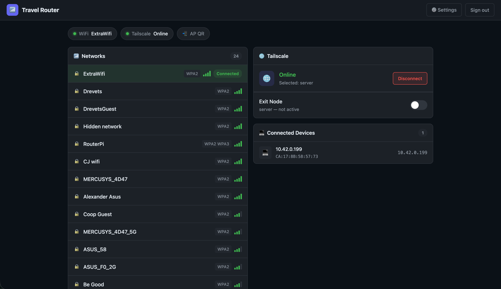

# RaspberryPiRouter


Turn a Raspberry Pi into a portable travel router with a small web UI for Wi-Fi control, private access-point settings, Tailscale exit-node management, and admin login.

## Overview

RaspberryPiRouter is a FastAPI-based control panel for managing a Raspberry Pi travel-router setup from your browser. It serves a dashboard, a settings page, and a login page, and exposes API endpoints for upstream Wi-Fi, hotspot configuration, Tailscale status/actions, and persisted router settings.

The project stores app configuration in a local `data.json` file and uses system tools such as `nmcli`, `ip`, and `tailscale` to apply network changes on the host.

## Features

- Web dashboard for upstream Wi-Fi status, nearby network scanning, and connected-device display
- Connect and disconnect from upstream Wi-Fi networks
- View a QR code for the private access-point password
- Update access-point SSID and password from the browser
- View Tailscale status and toggle Tailscale on/off
- Save a preferred Tailscale exit node and enable/disable it
- Session-based admin login with password change support
- Built-in OpenAPI docs at `/docs`

## Screenshots





## Tech Stack

- Python
- FastAPI
- Uvicorn
- Pydantic
- Vanilla HTML/CSS/JavaScript
- NetworkManager CLI (`nmcli`)
- Tailscale CLI

## Requirements

- Raspberry Pi OS or another Linux environment with NetworkManager
- Python 3.10+
- `nmcli`
- `tailscale`
- `sudo` permissions for network-management commands

## Quick Start

Clone the repository:

```bash
git clone git@github.com:DrevOliv/RaspberryPiRouter.git
cd RaspberryPiRouter
```

Create and activate a virtual environment:

```bash
python3 -m venv .venv
source .venv/bin/activate
```

Install dependencies:

```bash
pip install -r requirements.txt
```

Run the app:

```bash
python app.py
```

Open the web UI:

- Dashboard: `http://localhost:8080/`
- Settings: `http://localhost:8080/settings-page`
- Login: `http://localhost:8080/login`
- API docs: `http://localhost:8080/docs`

## First Login

On first startup, the app creates a default admin password:

```text
changeme
```

Change it from the Settings page after signing in.

## Configuration

The app reads and writes router settings through `data/data.json` by default. You can override runtime behavior with these environment variables:

| Variable | Description | Default |
| --- | --- | --- |
| `TRAVELROUTER_AUTH_COOKIE_NAME` | Name of the session cookie | `tr_session` |
| `TRAVELROUTER_AUTH_SESSION_TTL_SECONDS` | Session lifetime in seconds | `86400` |
| `TRAVELROUTER_AUTH_SECURE_COOKIE` | Set secure cookies when running behind HTTPS | `false` |
| `TRAVELROUTER_DATA_FILE_PATH` | Path to the JSON config file | `./data/data.json` |

Example:

```bash
export TRAVELROUTER_AUTH_SECURE_COOKIE=true
export TRAVELROUTER_DATA_FILE_PATH=/etc/travelrouter/data.json
python app.py
```

## Project Structure

```text
.
├── app.py
├── requirements.txt
├── data/
│   └── data.json
├── tests/
│   ├── test_wifi_api.py
│   └── test_tailscale_api.py
└── TravelRouter/
    ├── __init__.py
    ├── static/
    │   ├── index.html
    │   ├── login.html
    │   ├── settings.html
    │   └── style.css
    ├── helpers/
    ├── config_file/
    └── components/
        ├── auth/
        ├── settings/
        ├── tailscale/
        └── wifi/
```

## API Surface

| Area | Endpoints |
| --- | --- |
| Auth | `/api/auth/login`, `/api/auth/logout`, `/api/auth/change-password`, `/api/auth/session` |
| Settings | `/settings/config` |
| Wi-Fi | `/wifi/wifi-live`, `/wifi/connect`, `/wifi/disconnect`, `/wifi/ap-qr`, `/settings/wifi`, `/settings/wifi/ap-ssid`, `/settings/wifi/ap-password` |
| Tailscale | `/tailscale/status`, `/tailscale/selection`, `/tailscale/set-exit-node`, `/tailscale/disable-exit-node`, `/tailscale/up`, `/tailscale/down` |

## Security Note

This project is designed for a trusted router/admin environment. Review route-level authentication and system-command permissions carefully before exposing it beyond your local network.

## License

This project is released under [CC0 1.0 Universal](LICENSE).
